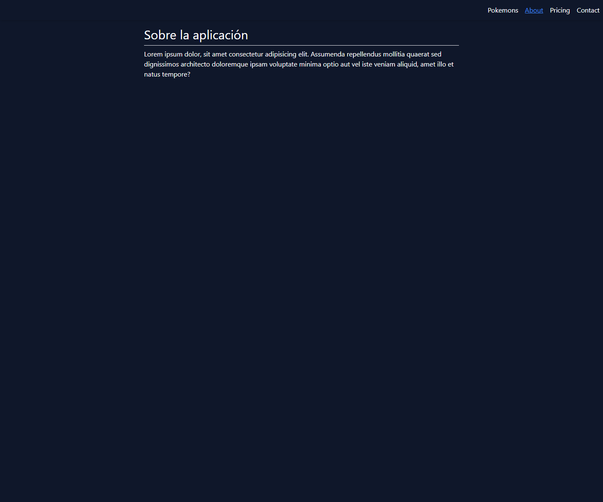
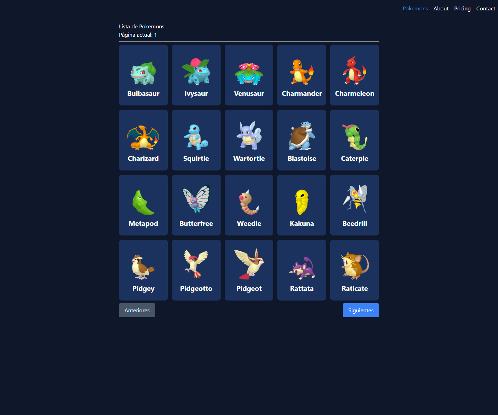
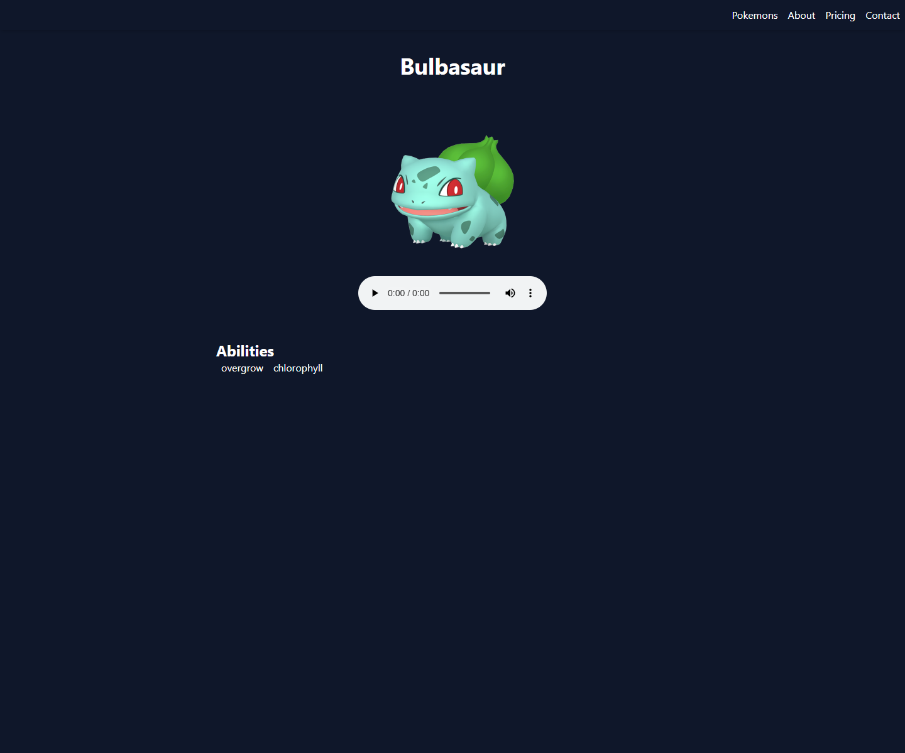

# Pokémon SSR

Aplicación Angular con Server Side Rendering para consultar Pokémon desde PokeAPI. El proyecto muestra listados paginados, páginas de detalle, sprites oficiales, metadatos SEO/Open Graph y generación de rutas para prerender.

## 🚀 Demo

> Actualmente no hay una demo pública disponible. El proyecto puede ejecutarse en local siguiendo las instrucciones de instalación.

## 📸 Capturas







## 🧩 Funcionalidades

* Listado paginado de Pokémon consumiendo `https://pokeapi.co/api/v2/pokemon`.
* Página de detalle por ID o nombre de Pokémon.
* Tarjetas con imagen oficial desde el repositorio de sprites de PokeAPI.
* Rutas lazy con componentes standalone.
* Skeleton de carga para el listado.
* Actualización dinámica de `Title` y metatags en la página de detalle.
* Metadatos Open Graph para título, descripción e imagen.
* Angular SSR con servidor Express.
* Script `scripts/prerender-routes.js` para generar `routes.txt` con rutas de Pokémon y páginas.
* Tests unitarios configurados para rutas, servicios y componentes.

## 🛠️ Tecnologías utilizadas

**Frontend**

* Angular 18
* TypeScript
* RxJS
* Angular Router
* Tailwind CSS

**SSR**

* Angular SSR
* Express
* Node.js

**API externa**

* PokeAPI

**Testing**

* Karma
* Jasmine
* Chrome Headless

## 🏗️ Arquitectura y estructura

```text
pokemon-ssr/
├── scripts/
│   └── prerender-routes.js
├── src/
│   ├── app/
│   │   ├── pages/
│   │   ├── pokemons/
│   │   │   ├── components/
│   │   │   ├── interfaces/
│   │   │   └── services/
│   │   ├── shared/
│   │   └── app.routes.ts
│   ├── main.ts
│   └── main.server.ts
├── server.ts
├── package.json
└── README.md
```

## ⚙️ Instalación y ejecución

```bash
npm install
npm start
```

La app se sirve normalmente en `http://localhost:4200/`.

## 🧪 Tests

```bash
npm test
```

El script está configurado con Chrome Headless:

```json
"test": "ng test --no-watch --no-progress --browsers ChromeHeadless"
```

## 📦 Build o despliegue

El build ejecuta tests, genera rutas de prerender y compila la app:

```bash
npm run build
```

Para servir la versión SSR generada:

```bash
npm run serve:ssr:pokemon-ssr
```

## 📌 Estado del proyecto

Proyecto académico/demo técnica con funcionalidad principal implementada.

Posibles mejoras futuras:

* Añadir capturas del listado y detalle.
* Documentar límites de prerender configurados en `scripts/prerender-routes.js`.
* Mejorar manejo visual de errores de PokeAPI.
* Añadir paginación visible si no está cubierta por la UI actual.
* Revisar textos en español/inglés para unificar idioma.

## 👨‍💻 Autor

Lorenzo Bellido Barrena

* Portfolio: https://lorenzo-bellido.vercel.app/
* LinkedIn: https://www.linkedin.com/in/lorenzo-bellido-barrena/
* GitHub: https://github.com/LorenzoBellidoBarrena
* Email: [lorenzobeba2@gmail.com](mailto:lorenzobeba2@gmail.com)
